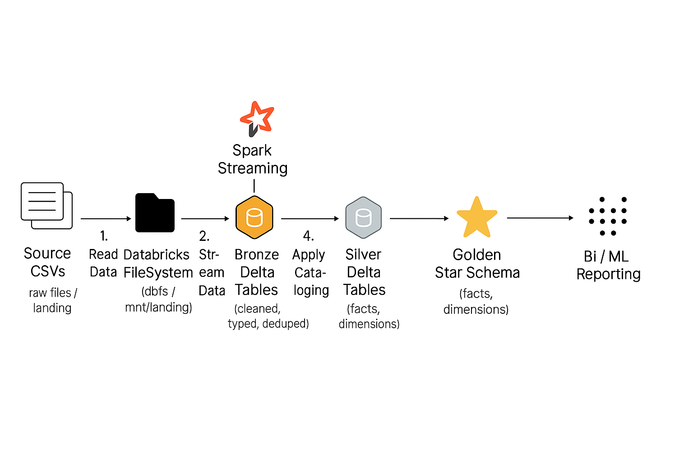

#  Rideshare Data Engineering Pipeline — Databricks + Spark + dbt




---

##  Project Overview

This project implements an **end-to-end Data Engineering pipeline** for a rideshare analytics platform.  
It ingests **raw CSV data** — including **customers, drivers, vehicles, trips, locations, and payments** — into **Databricks** using **Spark Structured Streaming**, organizes it into the **Medallion Architecture** (Bronze, Silver, Gold), and builds **star-schema models with dbt** for downstream **BI and ML** workloads.

---

##  Architecture Overview

| Layer | Description | Technology |
|-------|--------------|-------------|
| **Landing (Raw)** | Source CSV files for all entities (customers, drivers, vehicles, trips, payments, locations). | S3 / DBFS |
| **Bronze** | Raw data ingestion using **Spark Structured Streaming**. Each dataset is stored as a **Delta Table**. | Databricks + Spark |
| **Silver** | Cleaned, standardized, and deduplicated data. Adds timestamps and handles schema evolution. | Databricks Delta |
| **Gold** | **Star schema** models: `fact_trips`, `dim_customers`, `dim_drivers`, `dim_vehicles`, `dim_locations`, `fact_payments`. | dbt + Delta Tables |
| **Analytics** | Visualization and ML on top of gold tables (Power BI, Tableau, Databricks SQL, etc.). | BI / ML Tools |

---

##  Technologies Used

- **Apache Spark (Structured Streaming)** — for incremental ingestion and transformations  
- **Databricks** — for orchestration, notebooks, and Delta Lake  
- **Delta Lake** — for ACID-compliant tables and schema evolution  
- **dbt (Data Build Tool)** — for transformation, documentation, and incremental models  
- **Python / PySpark** — for transformation logic  
- **AWS S3 / DBFS** — for raw and processed data storage  
- **Power BI / Tableau** *(optional)* — for visualization  

---

##  Dataset Entities

| Dataset | Description | Key Fields |
|----------|--------------|------------|
| **customers.csv** | Customer profile info | `customer_id`, `name`, `signup_date`, `city` |
| **drivers.csv** | Driver details | `driver_id`, `name`, `license_number`, `city` |
| **vehicles.csv** | Vehicle registration and specs | `vehicle_id`, `driver_id`, `vehicle_type` |
| **trips.csv** | Trip logs | `trip_id`, `customer_id`, `driver_id`, `start_time`, `end_time`, `fare_amount` |
| **payments.csv** | Payment transactions | `payment_id`, `trip_id`, `amount`, `method`, `status` |
| **locations.csv** | City and geospatial metadata | `location_id`, `city_name`, `state`, `lat`, `lon` |

---

##  Medallion Architecture Implementation

###  Bronze — Ingestion Layer
- Reads **CSV data from landing zone** (S3 / DBFS).  
- Uses **Spark Structured Streaming** to continuously append data.  
- Adds metadata fields (`_ingest_ts`, `_source_file`).  
- Stored as **Delta Tables** under `analytics_bronze` catalog.

###  Silver — Transformation Layer
- Cleans and normalizes the Bronze data.  
- Converts datatypes, standardizes timestamps.  
- Deduplicates records based on business keys.  
- Adds audit columns (`processed_ts`, `batch_id`).  
- Stored in **`analytics_silver`** catalog.

###  Gold — Analytics Layer
- Builds **fact** and **dimension** tables via **dbt** incremental models.  
- Fact table: `fact_trips` combines trips, payments, and driver data.  
- Dimensions: `dim_customers`, `dim_drivers`, `dim_vehicles`, `dim_locations`.  
- Star schema designed for analytical queries and BI dashboards.  
- Stored in **`analytics_gold`** catalog.

---

##  Data Flow

```text
CSV Files (Raw)
   │
   ▼
Bronze Layer (Raw Delta)
   │  Spark Streaming → Delta
   ▼
Silver Layer (Cleaned)
   │  Transform, Deduplicate, Enrich
   ▼
Gold Layer (dbt Star Schema)
   │  Facts & Dimensions
   ▼
BI / ML / Reporting
